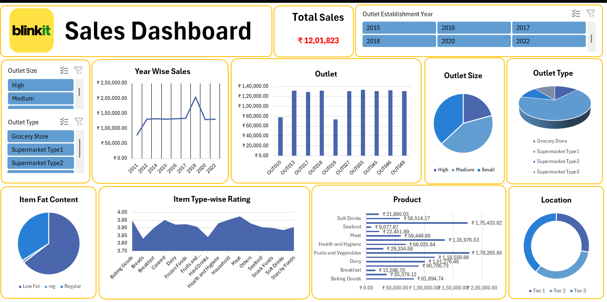
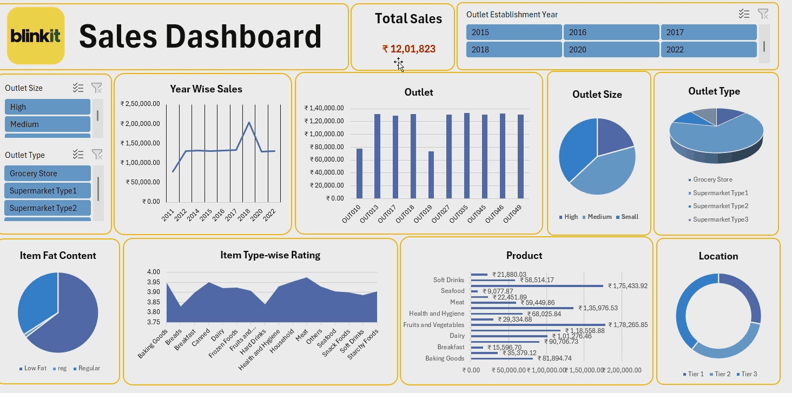

# 🛒 Blinkit Sales Dashboard

## 📝 Project Overview
This Excel dashboard analyzes Blinkit's (an e-grocery company) sales performance, showcasing insights into product categories, revenue trends, customer orders, and more.

## 📂 Files Included
- `Blinkit Sales Analysis.xlsx`: Dashboard with charts and slicers
- `Blinkit Sales.csv`: Raw transactional sales data
- `screenshots/dashboard.png`: Image preview of the dashboard

## 🔧 Tools & Features
- Pivot Charts and Tables
- Category-wise Sales Tracking
- Filters and Slicers
- Dynamic Dashboards

## 🎯 Interactivity
The dashboard is fully interactive:
- Use slicers to filter data by outlet size, outlet type, or outlet year
- Hover on charts to reveal exact values and trends
- Charts and KPIs update dynamically

## 📸 Dashboard Preview

## 🎥 Dashboard Demo

## ✅ How to Use
1. Download and open `Blinkit Sales.xlsx`.
2. Use slicers to filter by category, region, or date.
3. View insights on sales, revenue, and order trends.

---
