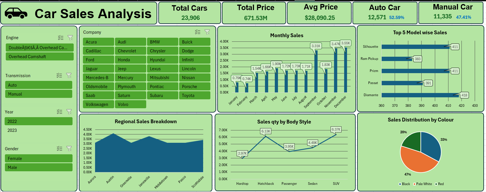
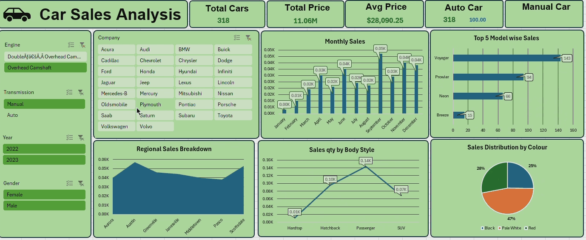

# 🚗 Car Analysis Dashboard

## 📝 Project Overview
This Excel project analyzes a dataset of cars, highlighting key metrics such as mileage, fuel type, brand comparison, and price distribution. The dashboard helps users easily compare different car segments.

## 📂 Files Included
- `Car Sales Analysis.xlsx`: Excel file with a dashboard and pivot analysis
- `Car Sales Data.csv`: Raw data of various car models
- `screenshots/dashboard.png`: Dashboard preview image

## 🔧 Tools & Features
- Pivot Tables
- Comparative Analysis by Brand
- Filters for gender, Transmission, Price Range
- Interactive Charts

## 🎯 Interactivity
Key interactive features:
- Use slicers to filter by company, engine, transmission, and year
- All visuals update instantly on slicer selection
- Hover over bar/line charts for exact value pop-ups

## 📸 Dashboard Preview

## 🎥 Dashboard Demo

## ✅ How to Use
1. Open `Car Sales Data.xlsx` in Excel.
2. Explore different filters (brand, fuel type, etc.)
3. View detailed price and mileage comparisons.

---
