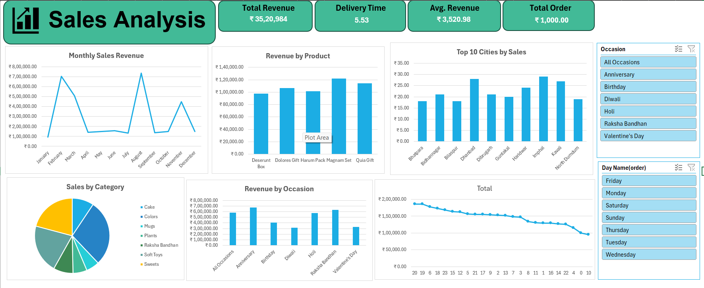
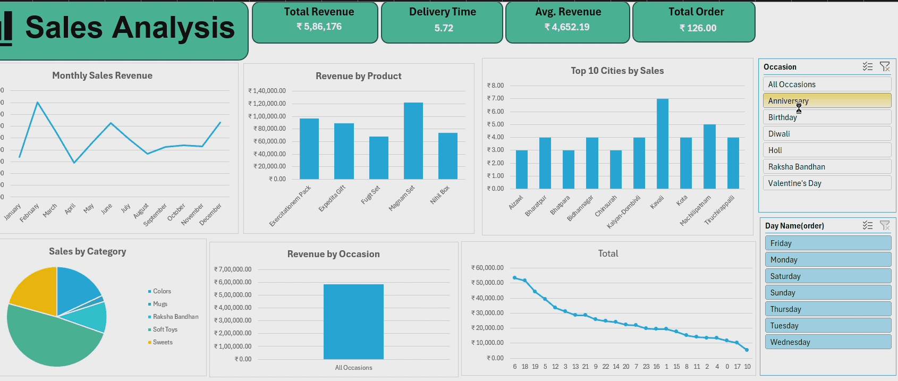

# 📊 Sales Analysis Dashboard

## 📝 Project Overview
This project provides a comprehensive sales analysis using Microsoft Excel. It demonstrates how raw sales data can be transformed into meaningful insights using pivot tables and visual dashboards.

## 📂 Files Included
- `Sales_Analysis.xlsx`: Contains pivot tables and the final dashboard
- `customers.csv`, `orders.csv`, `products.csv`: Raw sales dataset
- `screenshots/dashboard.png`: Dashboard preview image

## 🔧 Tools & Features
- Microsoft Excel
- Pivot Tables & Charts
- Slicers for interactivity

## 🎯 Interactivity
The dashboard includes slicers that let you:
- Filter data by occasion or day-name.
- Dynamically update charts and tables with a single click
- Hover over charts for detailed tooltips

This allows for an intuitive and responsive user experience directly inside Excel.

## 📸 Dashboard Preview

## 🎥 Dashboard Demo

## ✅ How to Use
1. Open `sales_analysis.xlsx` in Excel.
2. Explore pivot tables and charts.
3. Use slicers to filter data interactively.

---
